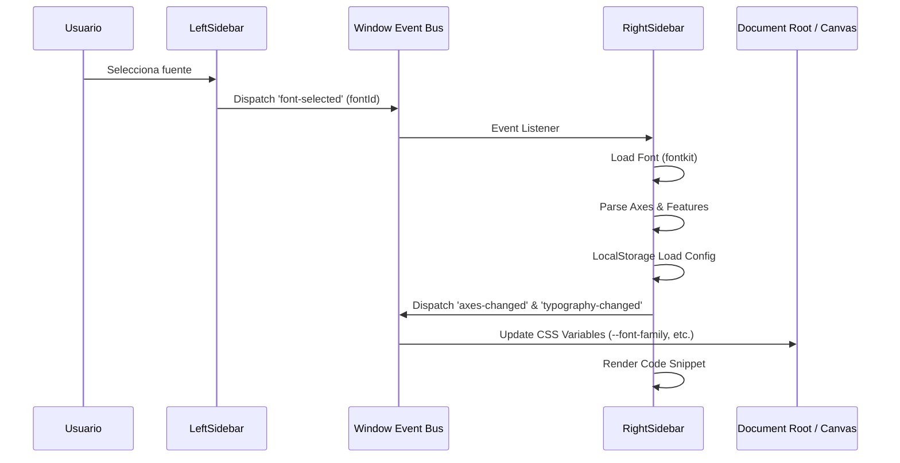
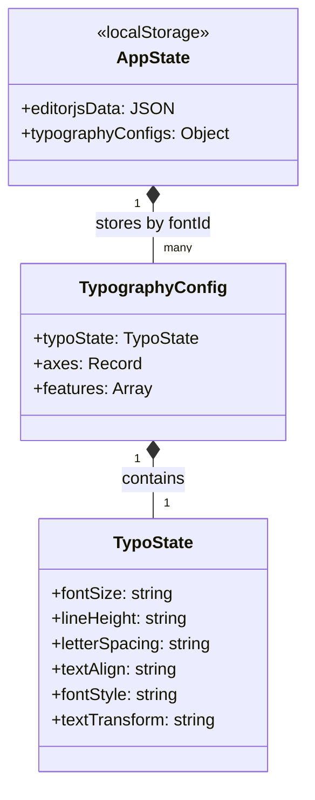

  

---

# Typography Playground: Arquitectura y Diseño de Sistema

He redactado este documento para detallar la arquitectura, decisiones de diseño y funcionamiento interno de **Typography Playground**, una aplicación web orientada al análisis y ajuste en tiempo real de fuentes variables (Variable Fonts) y características OpenType. El objetivo es desglosar la utilidad de la herramienta y explicar el razonamiento técnico detrás de su implementación.

## 1. Utilidad y Funcionamiento General

La complejidad intrínseca de la tipografía digital moderna, especialmente con la introducción de las fuentes variables (Variable Fonts) y el estándar OpenType, requiere interfaces capaces de exponer estas capacidades sin ofuscar la lógica subyacente. Typography Playground resuelve el problema de la inspección y manipulación de tipografías dinámicas al proveer un entorno controlado donde los ajustes visuales se traducen de forma instantánea a código CSS puro.

### Flujo Operativo Principal

1. **Selección y Carga de Activos:** El sistema carga archivos WOFF2 locales o instanciados y extrae metadatos profundos (ejes de variación, tablas GSUB/GPOS y glyphs) utilizando la librería `fontkit` en el lado del cliente, evitando llamadas redundantes al servidor.
2. **Manipulación del Canvas:** El lienzo central utiliza Editor.js para permitir la edición de texto estructurado. Los eventos generados por los controles laterales (deslizadores de ejes, toggles de OpenType, ajustes de em/px) se sincronizan con las variables CSS inyectadas en la raíz del documento.
3. **Generación de Salida Computada:** Mientras el usuario ajusta el entorno tipográfico, la aplicación compila un bloque de código CSS que refleja el estado actual del componente de previsualización, unificando `font-variation-settings` y `font-feature-settings` en tiempo real.

## 2. Análisis Profundo de Arquitectura y Modelos

He enmarcado el proyecto dentro de una arquitectura centrada en componentes estáticos con "islas" de interactividad, implementada sobre **Astro**. Dada la naturaleza de solo lectura de los archivos de fuentes y la ausencia de una base de datos persistente en el backend, la aplicación es inherentemente *client-heavy*.

### Arquitectura General y Patrones Estructurales

He optado por un enfoque basado en componentes de interfaz puros con manejo de estado local delegado a eventos del DOM (`CustomEvents`) y la API de `localStorage` para la persistencia de configuraciones. Este modelo se alinea con los principios de diseño de aplicaciones desacopladas, donde Astro compila la estructura estática (HTML/CSS) y la lógica de negocio puramente interactiva se adjunta en bloques de `<script>`.

- **Event-Driven UI:** Los componentes como `LeftSidebar` (selector de fuentes), `RightSidebar` (controles tipográficos) y `EditorCanvas` no mantienen un estado global complejo (ej. Redux o Zustand). En su lugar, despachan y escuchan eventos tipados (`font-selected`, `typography-changed`, `axes-changed`) montados sobre `window`.
- **Inversión de Control Estilístico:** Las clases nativas y de terceros (como las de Tailwind o Editor.js) son sobrescritas mediante el uso estratégico de CSS Variables (Custom Properties) que actúan como la única fuente de verdad para el renderizado del texto, garantizando que el Canvas siempre refleje la selección del panel derecho.

### Modelo de Flujo de Datos y Eventos

El siguiente diagrama ilustra cómo fluye la información desde la interacción del usuario hasta la actualización del lienzo y del código CSS:

### Componentes Clave y Responsabilidades

- **Configuración de Fuentes (`src/config/fonts.ts`):** Actúa como el diccionario estático de activos disponibles. Define las rutas WOFF2, nombres, y ejes por defecto para facilitar el mapeo.
- **Motor de Renderizado (Astro):** Orquesta la inyección del DOM inicial. Los scripts del lado del cliente son empaquetados por Vite, optimizando las dependencias pesadas como `fontkit`.
- **Procesador Tipográfico (`RightSidebar.astro`):** Contiene la lógica core de la aplicación. Extrae instancias tipográficas y mapea las etiquetas de cuatro letras de OpenType a controles booleanos en la UI.
- **Lienzo Editable (`EditorCanvas.astro`):** Envuelve la instancia de Editor.js. Es agnóstico a las fuentes; puramente hereda propiedades inyectadas en su contenedor padre.

### Manejo de Estado y Persistencia

El estado del lienzo de edición (contenido del usuario) y los ajustes específicos por familia de fuente (tamaños, características activadas) se guardan en `localStorage`. Este enfoque de persistencia offline garantiza que la herramienta sea rápida e interrumpible sin requerir un sistema de autenticación de usuarios.

## 3. Stack Tecnológico

La pila elegida optimiza la entrega de contenido estático rápido mientras soporta manipulación binaria en el cliente (parsing de fuentes).

| Tecnología | Rol y Razón Técnica |
| :--- | :--- |
| **Astro** | Framework principal. Permite la entrega de HTML puro con islas interactivas. Ideal para sitios estáticos o SPAs orientadas a contenido. |
| **TypeScript** | Añade seguridad de tipos sobre la definición de configuraciones de fuentes y eventos personalizados. |
| **Tailwind CSS** | Motor de estilos de utilidad. Facilita el estilado rápido de la UI de las barras laterales y los componentes interactivos. |
| **Editor.js** | Editor de texto basado en bloques utilizado en el lienzo principal, proveyendo salida JSON limpia en lugar de HTML sucio. |
| **Fontkit** | Motor de procesamiento de tipografías avanzado para el navegador. Analiza archivos de fuentes binarios para extraer datos de variación e instancias. |
| **Lucide / Astro** | Proveedor de iconografía SVG ligera. |

El acoplamiento de un editor rico basado en bloques con un analizador binario de fuentes instanciado en el cliente establece una arquitectura altamente resiliente y performante, evitando por completo la latencia de red en las operaciones de modificación en tiempo real. La separación de responsabilidades a través de eventos personalizados del DOM garantiza que el lienzo y los controles permanezcan lógicamente aislados, posibilitando futuras expansiones del proyecto sin refactorizaciones profundas.
